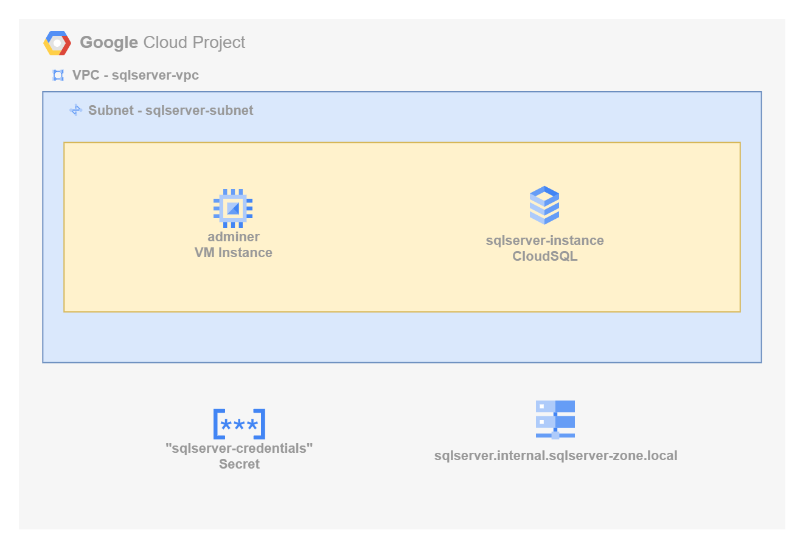
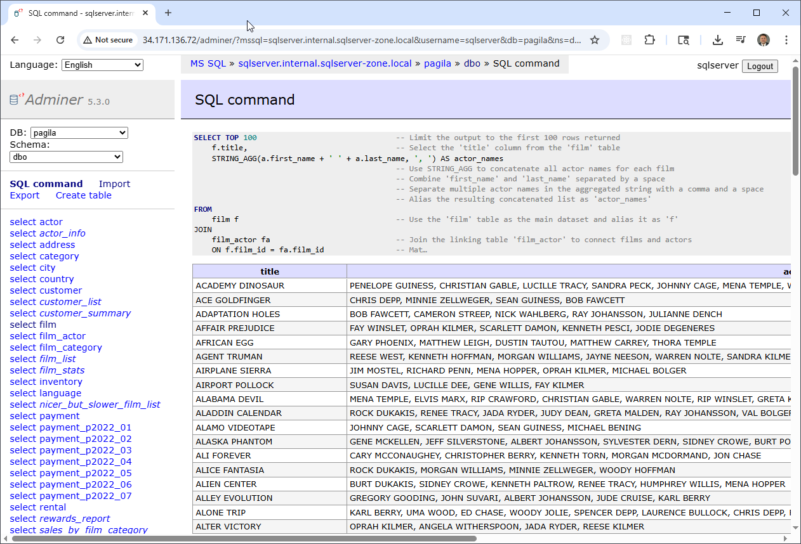

# Deploying SQL Server on Google Cloud Platform (GCP)

This project demonstrates how to deploy a secure, private SQL Server instance on Google Cloud using Terraform.

The deployment includes a Cloud SQL for SQL Server instance with public access disabled, integrated into a custom Virtual Private Cloud (VPC) and secured using private IP networking. Additionally, the project provisions a lightweight Ubuntu virtual machine that runs [Adminer](https://www.adminer.org/), a browser-based SQL client, allowing private, browser-accessible interaction with the database.

As part of the configuration, we've ported and deployed a SQL server version of the well known [Pagila Database](https://github.com/devrimgunduz/pagila). Pagila is a sample database modeled after the Sakila DVD rental database, commonly used for learning and testing relational database features

The solution is ideal for developers and teams looking to build secure, internal-facing applications without exposing the database to the public internet.



## What You'll Learn

- How to deploy a fully private SQL Server Cloud SQL instance on GCP using Terraform
- How to configure a custom VPC, subnet, and private IP for secure, internal connectivity
- How to provision a VM running `Adminer` for private browser-based database access
- Best practices for securing GCP-managed databases with private networking and infrastructure-as-code

## Prerequisites

* [A Google Cloud Account](https://console.cloud.google.com/)
* [Install gcloud CLI](https://cloud.google.com/sdk/docs/install) 
* [Install Latest Terraform](https://developer.hashicorp.com/terraform/install)

If this is your first time watching our content, we recommend starting with this video: [GCP + Terraform: Easy Setup](https://youtu.be/3spJpYX4f7I). It provides a step-by-step guide to properly configure Terraform, Packer, and the gcloud CLI.

## Download this Repository

```bash
git clone https://github.com/mamonaco1973/gcp-sqlserver.git
cd gcp-sqlserver
```

## Build the Code

Run [check_env.sh](check_env.sh) then run [apply.sh](apply.sh).

```bash
~/gcp-sqlserver$ ./apply.sh
NOTE: Validating that required commands are found in the PATH.
NOTE: gcloud is found in the current PATH.
NOTE: packer is found in the current PATH.
NOTE: terraform is found in the current PATH.
NOTE: jq is found in the current PATH.
NOTE: All required commands are available.
NOTE: Validating credentials.json and testing the gcloud command
Activated service account credentials for: [terraform-build@debug-project-446221.iam.gserviceaccount.com]
Initializing the backend...
Initializing provider plugins...
[...]
```

## Build Results

After applying the Terraform scripts, the following GCP resources will be created:

### VPC & Subnet
- VPC: `sqlserver-vpc`
  - CIDR range: `10.0.0.0/23`
- Subnet: `sqlserver-subnet`
  - Region-based subnet (e.g., `us-central1`)
  - CIDR: `10.0.0.0/25`
- Firewall Rules:
  - Allow internal traffic
  - Allow HTTP and SSH access to the `adminer-vm`

### Private Networking
- Private Service Connection:
  - Enables private IP for Cloud SQL
  - Ensures all communication stays within the VPC

### Cloud SQL for SQL Server
- Database Version: SQL Server 2019 (latest supported version)
- Instance: `sqlserver-instance`
  - Private IP only (no public access)
  - Credentials stored securely in Google Secret Manager

### Virtual Machine (Adminer)
- VM Name: `adminer-vm`
  - Ubuntu-based instance
  - Deployed in the same subnet
  - Uses startup script to install and run `Adminer`
  - Connects privately to SQL Server via internal IP

## Adminer Demo

[Adminer](https://www.adminer.org/) is a simple web-based and cross-platform SQL client.



Query 1:
```sql
SELECT TOP 100                       -- Limit the number of rows returned to 100
    f.title AS film_title,           -- Select the 'title' column from the 'film' table and rename it to 'film_title'
    a.first_name + ' ' + a.last_name AS actor_name 
                                     -- Concatenate 'first_name' and 'last_name' from the 'actor' table with a space
                                     -- Alias the concatenated result as 'actor_name' for readability
FROM
    film f                           -- Use the 'film' table as the primary dataset and alias it as 'f'
JOIN
    film_actor fa                    -- Join the linking table 'film_actor' that associates films with actors
    ON f.film_id = fa.film_id        -- Match rows where the film's unique ID equals the film_actor's film ID
JOIN
    actor a                          -- Join the 'actor' table to retrieve actor details
    ON fa.actor_id = a.actor_id      -- Match rows where the actor's unique ID equals the film_actor's actor ID
ORDER BY 
    f.title,                         -- Sort results by the film title in ascending alphabetical order
    actor_name;                      -- Within each film, sort the actor names alphabetically
```

Query 2:

```sql
SELECT TOP 100                               -- Limit the output to the first 100 rows returned
    f.title,                                 -- Select the 'title' column from the 'film' table
    STRING_AGG(a.first_name + ' ' + a.last_name, ', ') AS actor_names
                                             -- Use STRING_AGG to concatenate all actor names for each film
                                             -- Combine 'first_name' and 'last_name' separated by a space
                                             -- Separate multiple actor names in the aggregated string with a comma and a space
                                             -- Alias the resulting concatenated list as 'actor_names'
FROM
    film f                                   -- Use the 'film' table as the main dataset and alias it as 'f'
JOIN
    film_actor fa                            -- Join the linking table 'film_actor' to connect films and actors
    ON f.film_id = fa.film_id                -- Match rows where film IDs from both tables are equal
JOIN
    actor a                                  -- Join the 'actor' table to get actor details
    ON fa.actor_id = a.actor_id              -- Match rows where actor IDs from both tables are equal
GROUP BY
    f.title                                  -- Group the results by each film title so all associated actors are aggregated together
ORDER BY
    f.title;                                 -- Sort the output alphabetically by film title
```
