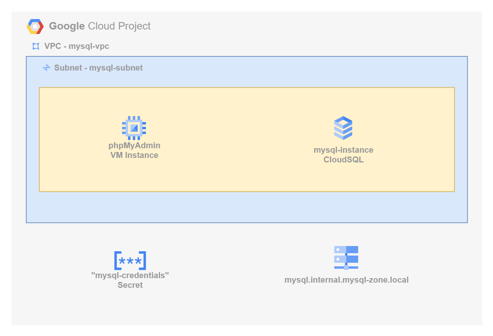
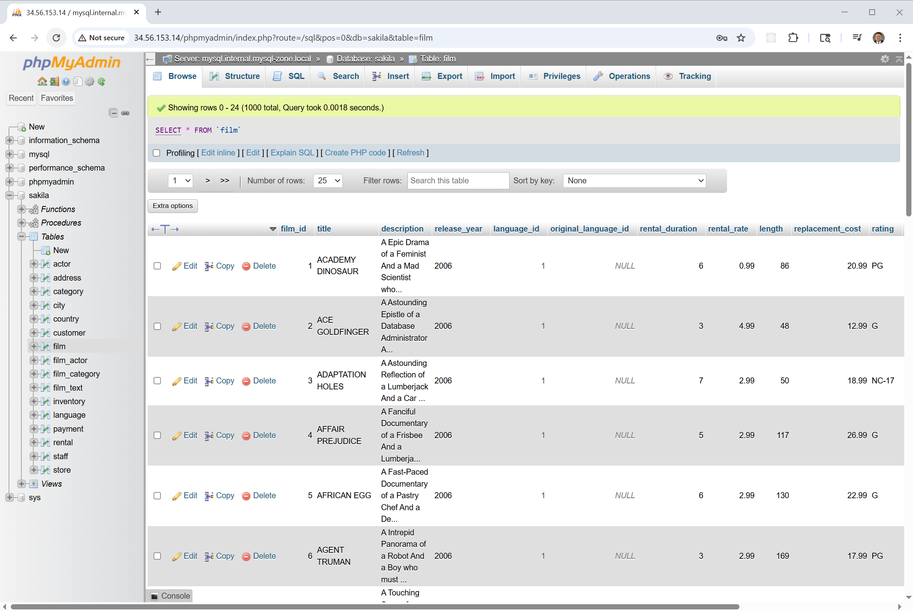

# Deploying MySQL on Google Cloud Platform (GCP)

This project demonstrates how to deploy a secure, private MySQL instance on Google Cloud using Terraform.

The deployment includes a Cloud SQL for MySQL instance with public access disabled, integrated into a custom Virtual Private Cloud (VPC) and secured using private IP networking. Additionally, the project provisions a lightweight Ubuntu virtual machine that runs [phpMyAdmin](https://www.phpmyadmin.net/), a browser-based MySQL client, allowing private, browser-accessible interaction with the database.

As part of the configuration, we deploy the [Sakila](https://dev.mysql.com/doc/sakila/en/) sample dataset—a fictional DVD rental database—to showcase real-world querying and administration in a private cloud context. The solution is ideal for developers and teams looking to build secure, internal-facing applications without exposing the database to the public internet.



## What You'll Learn

- How to deploy a fully private MySQL Cloud SQL instance on GCP using Terraform
- How to configure a custom VPC, subnet, and private IP for secure, internal connectivity
- How to provision a VM running `phpMyAdmin` for private browser-based database access
- Best practices for securing GCP-managed databases with private networking and infrastructure-as-code

## Prerequisites

* [A Google Cloud Account](https://console.cloud.google.com/)
* [Install gcloud CLI](https://cloud.google.com/sdk/docs/install) 
* [Install Latest Terraform](https://developer.hashicorp.com/terraform/install)

If this is your first time watching our content, we recommend starting with this video: [GCP + Terraform: Easy Setup](https://youtu.be/3spJpYX4f7I). It provides a step-by-step guide to properly configure Terraform, Packer, and the gcloud CLI.

## Download this Repository

```bash
git clone https://github.com/mamonaco1973/gcp-mysql.git
cd gcp-mysql
```

## Build the Code

Run [check_env.sh](check_env.sh) then run [apply.sh](apply.sh).

```bash
~/gcp-mysql$ ./apply.sh
NOTE: Validating that required commands are found in the PATH.
NOTE: gcloud is found in the current PATH.
NOTE: packer is found in the current PATH.
NOTE: terraform is found in the current PATH.
NOTE: jq is found in the current PATH.
NOTE: All required commands are available.
NOTE: Validating credentials.json and test the gcloud command
Activated service account credentials for: [terraform-build@debug-project-446221.iam.gserviceaccount.com]
Initializing the backend...
Initializing provider plugins...
- Reusing previous version of hashicorp/random from the dependency lock file
- Reusing previous version of hashicorp/google from the dependency lock file
- Reusing previous version of hashicorp/google-beta from the dependency lock file
- Reusing previous version of hashicorp/null from the dependency lock file
- Using previously-installed hashicorp/google v5.45.2
- Using previously-installed hashicorp/google-beta v4.85.0
- Using previously-installed hashicorp/null v3.2.4
- Using previously-installed hashicorp/random v3.7.2

Terraform has been successfully initialized!
[...]
```

## Build Results

After applying the Terraform scripts, the following GCP resources will be created:

### VPC & Subnet
- VPC: `mysql-vpc`
  - CIDR range: `10.0.0.0/23`
- Subnet: `mysql-subnet`
  - Region-based subnet (e.g., `us-central1`)
  - CIDR: `10.0.0.0/25`
- Firewall Rules:
  - Allow internal traffic
  - Allow HTTP and SSH access to the `phpmyadmin-vm`

### Private Networking
- Private Service Connection:
  - Enables private IP for Cloud SQL
  - Ensures all communication stays within the VPC

### Cloud SQL for MySQL
- Database Version: MySQL 8.0
- Instance: `mysql-instance`
  - Private IP only (no public access)
  - Preloaded with [Sakila sample database](https://dev.mysql.com/doc/sakila/en/)
  - Credentials stored securely in Google Secret Manager

### Virtual Machine (phpMyAdmin)
- VM Name: `phpmyadmin-vm`
  - Ubuntu-based instance
  - Deployed in the same subnet
  - Uses startup script to install and run `phpMyAdmin`
  - Connects privately to MySQL via internal IP

## phpMyAdmin Demo

[phpMyAdmin](https://www.phpmyadmin.net/) is a simple web-based and cross-platform MySQL database explorer.



Query 1:
```sql
SELECT
    -- Select the film title from the 'film' table and label the column 'film_title'
    f.title AS film_title,

    -- Concatenate the actor's first and last name with a space between them and label the column 'actor_name'
    CONCAT(a.first_name, ' ', a.last_name) AS actor_name

FROM
    -- Use the 'film' table as the main source of data (alias 'f')
    sakila.film f

    -- Join the 'film_actor' link table to associate films with their actors by film_id
    JOIN sakila.film_actor fa
        ON f.film_id = fa.film_id

    -- Join the 'actor' table to get actor name details by actor_id
    JOIN sakila.actor a
        ON fa.actor_id = a.actor_id

-- Sort the results first by film title alphabetically, then by actor name alphabetically within each film
ORDER BY
    f.title,
    actor_name

-- Return only the first 20 rows of the result set
LIMIT 20;                                                   
```

Query 2:

```sql
SELECT
    -- Select the film title from the 'film' table
    f.title,

    -- Concatenate all actor full names (first + last name) into a single string
    -- GROUP_CONCAT builds this list, ordering by actor last name, separating each with a comma and space
    GROUP_CONCAT(
        CONCAT(a.first_name, ' ', a.last_name)
        ORDER BY a.last_name
        SEPARATOR ', '
    ) AS actor_names

FROM
    -- Use the 'film' table as the starting point (aliased as 'f')
    sakila.film f

    -- Join 'film_actor' to link films to their actors via film_id
    JOIN sakila.film_actor fa
        ON f.film_id = fa.film_id

    -- Join 'actor' to get the actual actor names via actor_id
    JOIN sakila.actor a
        ON fa.actor_id = a.actor_id

-- Group results by film title so each row represents a unique film
GROUP BY
    f.title

-- Sort the output rows alphabetically by film title
ORDER BY
    f.title

-- Only return the first 10 rows (the top 10 film titles alphabetically)
LIMIT 10;
```